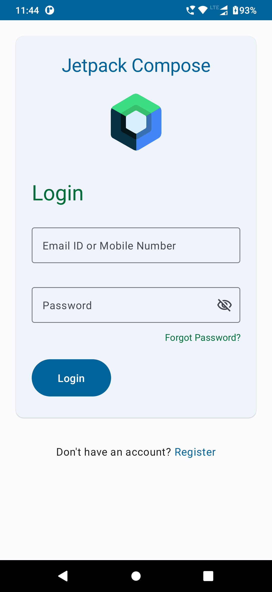
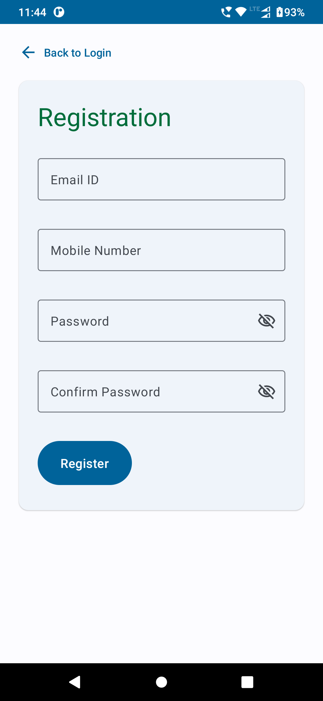
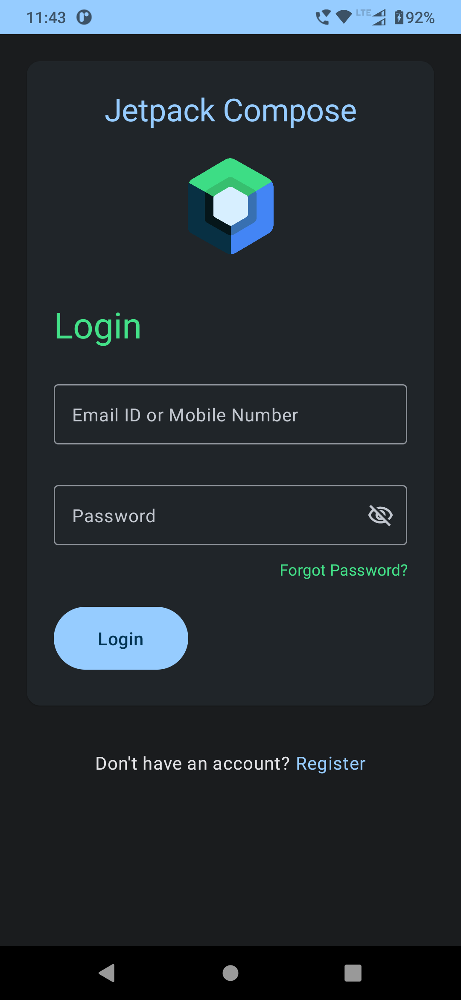
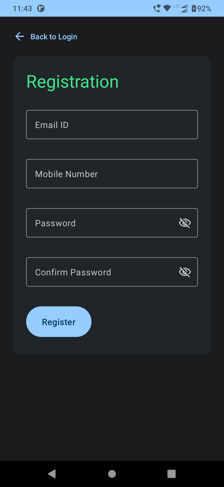

# LoginWithJetpackCompose

A simple android application containing login and registration built using jetpack compose. The app
shows a clean way of handling login and registration state along with nested navigation.

### :scroll: Overview

1. Login with simple empty validations
2. Registration with simple empty validations
3. Usage of icon and password toggle
4. State management for input field updates, button event update and navigation with the help of
   viewmodel
5. Nested navigation showing two different navigation routes for authenticated and unauthenticated
   route

### :camera: Screenshots

#### Light




#### Dark




## License

```
Copyright 2023 The Android Open Source Project

Licensed under the Apache License, Version 2.0 (the "License");
you may not use this file except in compliance with the License.
You may obtain a copy of the License at

    https://www.apache.org/licenses/LICENSE-2.0

Unless required by applicable law or agreed to in writing, software
distributed under the License is distributed on an "AS IS" BASIS,
WITHOUT WARRANTIES OR CONDITIONS OF ANY KIND, either express or implied.
See the License for the specific language governing permissions and
limitations under the License.
```
